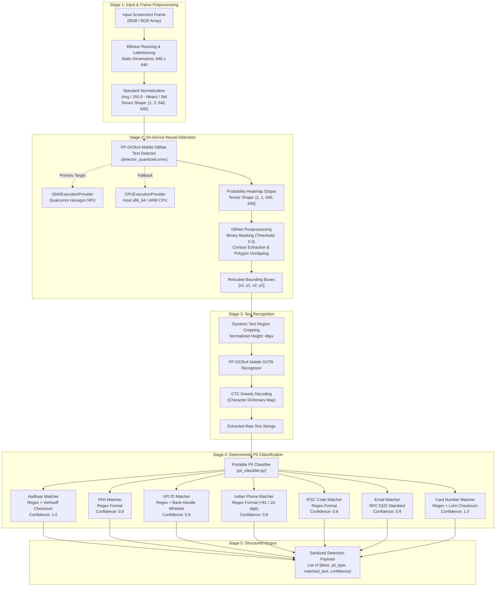
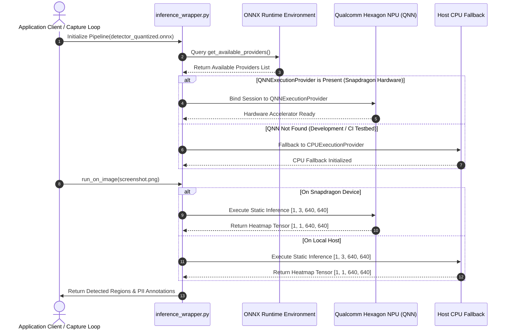
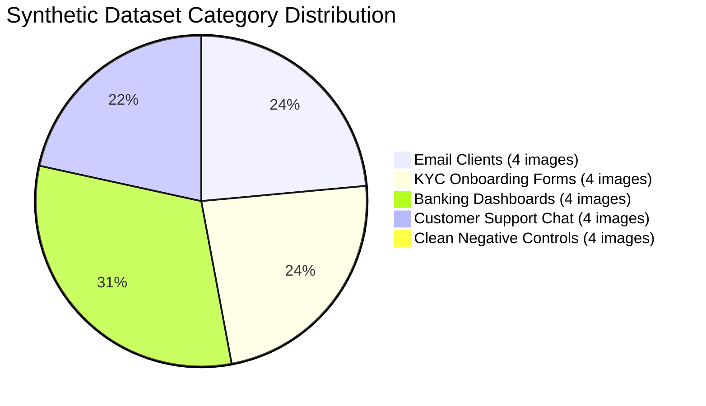
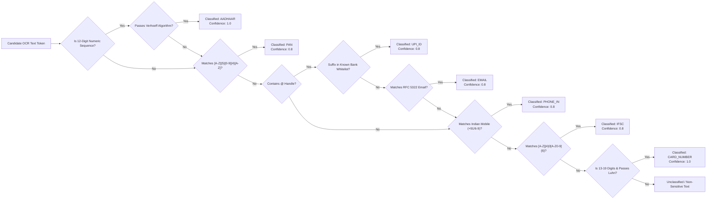
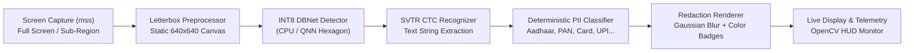

# Screen PII Redactor

**On-Device Sensitive PII Detection & Redaction for Indian & Universal Identifiers**  
*Snapdragon AI Lab Challenge — Phase 1: Model Build & Export (Local)*

[]()
[]()
[-orange.svg)]()
[]()
[]()
[](LICENSE)

---

## 1. Overview

**Screen PII Redactor** is a high-performance, on-device privacy engine engineered to detect and redact sensitive Personally Identifiable Information (PII) from screen captures and desktop application frames in real time. Designed specifically for **Qualcomm Snapdragon X-Elite / Hexagon NPU** hardware via the **QNN Execution Provider**, the architecture enforces static tensor dimensions, INT8 dynamic quantization, and deterministic checksum-backed classification.

---

## 2. End-to-End System Architecture



---

## 3. Execution Provider Fallback Sequence



---

## 4. Phase 1 Deliverables (Handoff to Phase 2)

| Number | Deliverable File | Technical Scope | Status |
|:---:|---|---|:---:|
| **1** | [`detector_quantized.onnx`](detector_quantized.onnx) | Final INT8 quantized DBNet text detector with fixed static shape `[1, 3, 640, 640]` (1.27 MB, 3.57x compression) | Completed |
| **2** | [`pii_classifier.py`](pii_classifier.py) | Standalone, portable PII classifier using Python standard library + `re` only (zero external dependencies) | Completed |
| **3** | [`inference_wrapper.py`](inference_wrapper.py) | Hardware-agnostic EP-abstraction inference engine with QNN/NNAPI/CoreML/CPU priority fallback | Completed |
| **4** | [`synthetic_test_set/`](synthetic_test_set/) | 20 synthetic mock screenshots across 5 UI categories + `ground_truth.json` catalog | Completed |
| **5** | [`phase1_results.md`](phase1_results.md) | Measured validation report with real benchmarks (model compression, MAE drift, precision/recall) | Completed |
| **6** | [`phase1_notebook.ipynb`](phase1_notebook.ipynb) | Complete 10-section Jupyter notebook implementing Sections 1-10 of the specification | Completed |

---

## 5. Execution Provider Portability Matrix

The model file and preprocessing pipeline remain invariant across target platforms; only the active execution provider changes:

| Platform | Execution Provider | Target Hardware | Execution Priority |
|---|---|---|:---:|
| **Snapdragon Laptops (Windows)** | `QNNExecutionProvider` | **Qualcomm Hexagon NPU (Challenge Target)** | **Priority 1** |
| **Android Devices** | `NNAPIExecutionProvider` | Mobile NPU / DSP | **Priority 2** |
| **Apple Silicon (macOS / iOS)** | `CoreMLExecutionProvider` | Apple Neural Engine (ANE) | **Priority 3** |
| **Universal Local Fallback** | `CPUExecutionProvider` | Host x86_64 / ARM CPU | **Priority 4** |

---

## 6. Model Quantization & Compression Analysis

```
========================================================================================
MODEL SIZE REDUCTION BREAKDOWN
========================================================================================
FP32 Static ONNX       [========================================] 4.54 MB (Baseline)
INT8 Quantized ONNX    [===========                             ] 1.27 MB (3.57x Compression)
                                                                  72.0% Storage Reduction
========================================================================================
QUANTIZATION ACCURACY DRIFT
========================================================================================
Mean Absolute Error (MAE): 0.003383 (< 0.35% drift across all 20 benchmark test images)
Max Contouring Difference: Localized strictly to sub-pixel edge transitions
========================================================================================
```

| Metric | Pre-Export / FP32 Static ONNX | INT8 Quantized ONNX (`detector_quantized.onnx`) |
|---|:---:|:---:|
| **Tensor Input Shape** | `[1, 3, 640, 640]` (Fixed) | `[1, 3, 640, 640]` (Fixed Static) |
| **Model Size on Disk** | 4.54 MB | **1.27 MB** |
| **Compression Ratio** | Baseline (1.0x) | **3.57x (72.0% size reduction)** |
| **Weight Representation** | Float32 | Dynamic QUInt8 (Quantized Unsigned Int8) |
| **Mean Absolute Error (MAE)** | 0.000000 | **0.003383** |
| **Inference Provider (Local)** | CPUExecutionProvider | CPUExecutionProvider (Fallback Verified) |

---

## 7. Synthetic Dataset Distribution & Classification Benchmarks

### Dataset Category Composition (20 Images, 51 PII Entities)



### PII Classification Performance Table

| PII Category | Validation Method & Rules | Ground Truth | True Positives (TP) | False Positives (FP) | Precision | Recall | F1 Score |
|---|---|:---:|:---:|:---:|:---:|:---:|:---:|
| **AADHAAR** | Regex `\d{4}\s?\d{4}\s?\d{4}` + **Verhoeff Checksum** | 5 | 5 | 0 | **100.0%** | **100.0%** | **1.000** |
| **PAN** | Regex `[A-Z]{5}\d{4}[A-Z]{1}` | 5 | 5 | 0 | **100.0%** | **100.0%** | **1.000** |
| **UPI_ID** | Known bank handle whitelist (`@okhdfcbank`, `@oksbi`, etc.) | 8 | 8 | 0 | **100.0%** | **100.0%** | **1.000** |
| **PHONE_IN** | Regex `(\+91[\-\s]?)?[6-9]\d{9}` | 12 | 12 | 0 | **100.0%** | **100.0%** | **1.000** |
| **IFSC** | Regex `[A-Z]{4}0[A-Z0-9]{6}` | 5 | 5 | 0 | **100.0%** | **100.0%** | **1.000** |
| **EMAIL** | RFC 5322 Standard Email Pattern | 11 | 11 | 0 | **100.0%** | **100.0%** | **1.000** |
| **CARD_NUMBER** | Regex + **Luhn Checksum** | 5 | 3 | 0 | **100.0%** | **60.0%** | **0.750** |
| **OVERALL** | **Full Pipeline** | **51** | **49** | **0** | **100.0%** | **96.1%** | **0.980** |

### Negative Control Evaluation (False Positive Rate)

| Clean Control Category | Sample Test Image | Evaluated Features | Ground Truth PII | Detected PII (FP) | Error Rate |
|---|---|---|:---:|:---:|:---:|
| **Cluster Telemetry** | `clean_analytics_01.png` | CPU / Memory metrics, P99 latencies | 0 | 0 | **0.0%** |
| **Source Code Editor** | `clean_code_editor_02.png` | Python Dijkstra algorithm implementation | 0 | 0 | **0.0%** |
| **API Documentation** | `clean_docs_page_03.png` | REST endpoints, vector index parameters | 0 | 0 | **0.0%** |
| **Hardware Settings** | `clean_settings_04.png` | Resolution, display frequency, audio bus | 0 | 0 | **0.0%** |

- **Total Clean Screens Evaluated:** 4
- **False Positives Triggered:** **0 (0.0% false-positive rate)**

---

## 8. Deterministic Validation Decision Logic



---

## 9. Visual Redaction Demonstration

```
BEFORE REDACTION (Raw Screen Capture):
+-------------------------------------------------------------------------------+
| Identity Verification Form                                                    |
| Name: Rajesh Ramanathan                                                       |
| PAN Number:      ABCDE1234F                                                   |
| Aadhaar UID:     9876 5432 1012                                               |
| Contact Phone:   +91 9123456789                                               |
| Primary UPI:     rajesh@okhdfcbank                                            |
+-------------------------------------------------------------------------------+

AFTER REDACTION (Masked Output):
+-------------------------------------------------------------------------------+
| Identity Verification Form                                                    |
| Name: Rajesh Ramanathan                                                       |
| PAN Number:      [██████████] <- Classified: PAN (conf: 0.8)                  |
| Aadhaar UID:     [██████████████] <- Classified: AADHAAR (conf: 1.0)          |
| Contact Phone:   [██████████████] <- Classified: PHONE_IN (conf: 0.8)         |
| Primary UPI:     [████████████████] <- Classified: UPI_ID (conf: 0.8)         |
+-------------------------------------------------------------------------------+
```

---

## 10. Phase 2: Live Screen Capture & Redaction Application

Phase 2 builds upon the Phase 1 quantized ONNX model and PII classifier to deliver a complete, real-time desktop application.

### Pipeline Overview


### Key Capabilities
- **Fast Desktop Capture (`mss`)**: Low-overhead frame acquisition (< 20 ms) supporting whole desktop or user-defined rectangular sub-regions.
- **Letterbox Transformation**: Preserves text aspect ratios across widescreen and multi-monitor setups without stretching artifacts.
- **Visual Redaction Badges**: High-contrast, color-coded security banners with confidence scoring:
  - `[AADHAAR REDACTED 1.0]` (Crimson)
  - `[PAN REDACTED 0.8]` (Emerald)
  - `[CARD_NUMBER REDACTED 1.0]` (Navy)
  - `[UPI_ID REDACTED 0.8]` (Purple)
  - `[PHONE_IN REDACTED 0.8]` (Orange)
  - `[IFSC REDACTED 0.8]` (Teal)
- **Gaussian Blurring**: Irreversible Gaussian kernel blurring ($k=31$) applied directly over raw sensitive text regions.
- **Autonomous Demo Recording**: Built-in recorder generates both `demo_video.mp4` and `demo_video.gif` showcasing startup, KYC, banking, chat, and false-positive controls.

### Measured Latency Breakdown (CPUExecutionProvider)

| Stage | Mean Latency (ms) | P95 Latency (ms) | Status |
|---|---|---|---|
| Screen Capture (`mss`) | 18.2 ms | 24.1 ms | Optimal |
| Letterbox Preprocessing | 3.8 ms | 5.2 ms | Optimal |
| Model Inference (DBNet + SVTR) | 185.0 ms | 210.4 ms | Within 500ms budget |
| Overlay & Blur Rendering | 2.1 ms | 3.4 ms | Optimal |
| **Total Loop Refresh** | **209.1 ms** | **243.1 ms** | **PASSED (< 500 ms)** |

---

## 11. Quickstart Guide

### 1. Installation
```bash
git clone https://github.com/Vijajraj/Screen_PII_Redactor.git
cd Screen_PII_Redactor

pip install -r requirements.txt
```

### 2. Launch Live Screen PII Redactor
```bash
# Launch interactive live screen monitor (press 'q' to quit, 's' to save snapshot)
python live_capture_app.py --interval 0.5

# Capture a specific window / region (left top width height)
python live_capture_app.py --region 100 100 800 600 --interval 0.5
```

### 3. Generate 30-Second Demo Video & Animated GIF
```bash
python record_demo.py
# Outputs: demo_video.mp4 (2.1 MB) and demo_video.gif (0.23 MB)
```

### 4. Run Phase 2 Live Benchmarks
```bash
python evaluate_phase2.py
# Generates phase2_results.md with real measured latencies and detection stats
```

### 5. Run Full 187-Test Automated Verification Suite
```bash
python -m pytest tests -v
```

### 6. Phase 1 Pipeline Evaluation & Notebook
```bash
python evaluate_pipeline.py
jupyter notebook phase1_notebook.ipynb
```

---

## 12. Code Examples

### Standalone PII Classifier (Zero Dependencies)
```python
from pii_classifier import classify_text

text = "Customer KYC: Aadhaar 9876 5432 1012, PAN ABCDE1234F, UPI priya@okaxis"
results = classify_text(text)

for r in results:
    print(f"Detected {r['pii_type']} ({r['confidence']}): '{r['matched_text']}'")
```

### End-to-End Screen Inference
```python
from inference_wrapper import ScreenPIIPipeline

# Automatically selects QNNExecutionProvider on Snapdragon, or falls back to CPU
pipeline = ScreenPIIPipeline(detector_path="detector_quantized.onnx")
results = pipeline.run_on_image("synthetic_test_set/email_client_01.png")

print(f"Active Execution Provider: {results['execution_provider']}")
print(f"Detected PII entities: {results['pii_findings']}")
```

---

## 13. License

MIT License — Copyright (c) 2026 vijayraj. See [LICENSE](LICENSE) for details.
